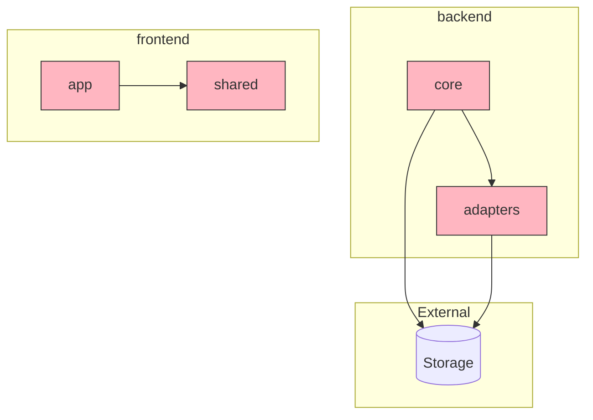

# System Architecture Diagram

```mermaid
graph TD;
    subgraph backend;
        backend_core[core];
        style backend_core fill:#FFB6C1,stroke:#333,color:#333;
        backend_adapters[adapters];
        style backend_adapters fill:#FFB6C1,stroke:#333,color:#333;
    end;
    subgraph frontend;
        frontend_shared[shared];
        style frontend_shared fill:#FFB6C1,stroke:#333,color:#333;
        frontend_app[app];
        style frontend_app fill:#FFB6C1,stroke:#333,color:#333;
    end;
    subgraph External;
        Storage[(Storage)];
    end;

    %% Cross-package dependencies
    backend_core --> Storage;
    backend_adapters --> Storage;

    %% Shared module dependencies
    backend_core --> backend_adapters;
        frontend_app --> frontend_shared;
```

## Legend
- 🟩 Green boxes represent stable modules
- 💗 Pink heart represents experimental modules (fill: #FFB6C1)
